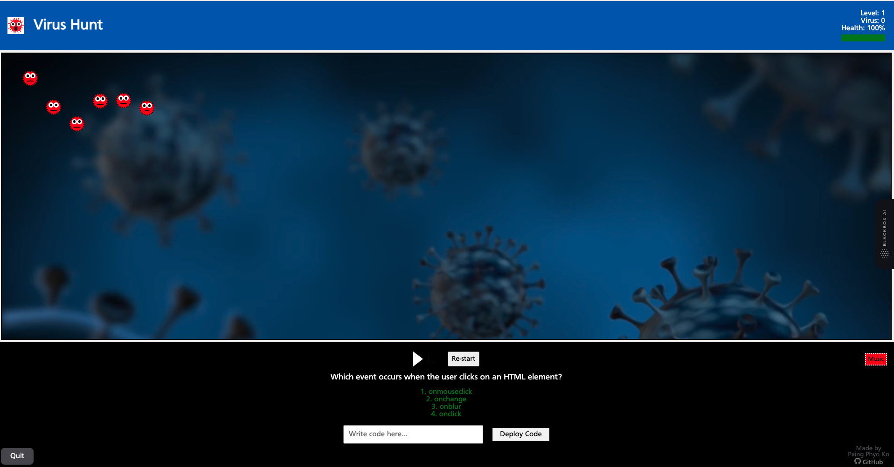

# (NHS) Virus Hunt Game 🏥 🔬 🦠 👨‍💻

## Introduction
Hello, World! :wave: I'm **Paing Phyo Ko**, a former medical doctor from Myanmar who is turning over a new leaf by diving into the fascinating world of web development.

Welcome to my very first game, "The NHS Virus Hunt", a game designed for those with basic knowledge of coding and health! This game was built as a part of my application for Founders and Coders (FAC) to showcase my skills in HTML, CSS, and Vanilla JavaScript and as a part of my portfolio website.

The game offers an intriguing and educational adventure, where you take on the role of an NHS staff member armed with coding skills and medical knowledge. You will deploy your knowledge to create defense mechanisms within a human body invaded by viruses.

:link: [Play my game here](https://paing-ko.github.io/myGame/)

## :video_game: Game Overview

In this game, your mission is to protect a human body from an onslaught of viruses by solving coding and health-related challenges. Armed with your coding skills and medical knowledge, you are humanity's last hope. 

### :joystick: Gameplay

* The game is set in a human body that has been invaded by viruses.
* You will need to create defenses within the body to hunt and eradicate viruses.
* You will be given two types of questions (coding and health), each having 4 options to choose from.
* Choose the correct code or answer to deploy your defenses.

### :scroll: Storyline

As you were working on your project, you discovered that viruses have invaded the human body and are causing chaos. Make use of your medical expertise, choose the correct code and deploy it to save the day!

### :triangular_ruler: Rules

* Game starts with Level: 1, Virus: 0 & Health: 100%, with no time limit.
* You will be given two types of questions (coding and health) each having 4 options to choose from.
* Coding challenges and options will be displayed in green.
* Type the number of your answer and deploy it to combat viruses.
* Your score increases for each virus eliminated.
* After eliminating a certain number of viruses, your level will increase, and the game will
                        become faster with each
                        level-up.
* To keep your health above 0, answer health-related questions in red (+5 for correct answers).
* Be careful! If you answer incorrectly or virus escape and hit the wall, you lose health (by -5).
* The game ends when your health reaches zero.

### :headphones: Soundtracks

The game features the following soundtracks to create a fun, vibrant and engaging atmosphere:
* "Evil Cue"
* "Bella Ciao"
* "Never Gonna Give You Up" by Rick Astley

## :hammer_and_wrench: Technologies Used 

* HTML
* CSS
* JavaScript

## Project Requirements

This game was built adhering to the following project requirements:

* Built using only HTML, CSS, and vanilla JavaScript.
* Does not use external libraries.
* Is original and engaging.
* Includes user interaction, rules, win/lose conditions, and a scoring system.

## Acknowledgements

This project was inspired by my passion for coding and interest in healthcare. It is built for educational purposes and to bring awareness to the importance of health education and as well as programming knowledge as we are living in AI era.
I tried to imitate the NHS logo and font using Frutiger, background-color: #005EB8 and color: #ffffff.

## :no_entry_sign: Note  

Interested in learning more about health and medical knowledge after playing? Visit the [NHS website](https://www.nhs.uk/) for a wealth of information on health and medical topics.

Also, visit [Harvard's CS50](https://cs50.harvard.edu/x/2023/)and [freeCodeCamp website](https://www.freecodecamp.org/) for more coding and programming knowledge.

## :earth_africa: Hosting

This game is hosted using GitHub Pages.

:link: [Play my game here](https://paing-ko.github.io/myGame/)
Go to intro and read the rules and enter the game.
I even added (optional)background music with mute/unmute button.

## :file_folder: Repository

The code for this game is open source and available on GitHub.

:link: [GitHub Repository](https://github.com/Paing-Ko/myGame)

## :envelope: Feedback and Contact

I would love to hear your feedback! If you have any comments, suggestions, or want to connect, please don't hesitate to reach out.

:email: paingphyoko.keke@gmail.com

## :heart: Thank You!

Thank you for taking the time to explore my game. I'm excited about my journey in web development and sharing it with the world.

Warm regards,

**Paing Phyo Ko**

---

